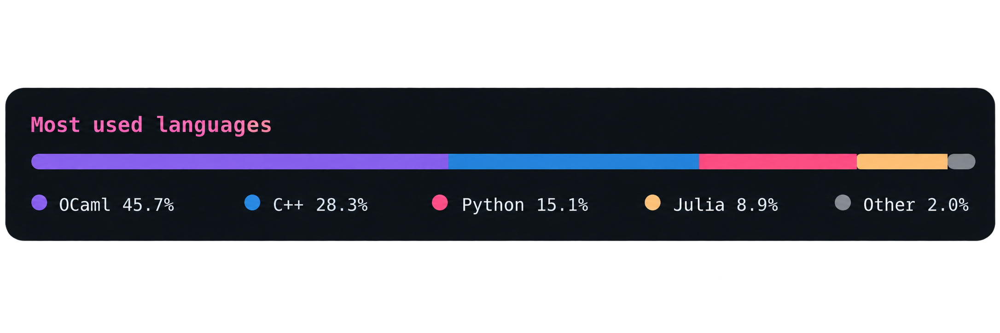

<h1 align="center">Hi, I'm Andrei Dunaev.</h1>

  

  

  
  
  
  
  
  
  
  
  
  
  
  
  
  
  
  
  

## What I do

I build quantitative research, execution, and risk systems for systematic trading, with a focus on market inefficiencies that survive fees, slippage, regime shifts, and real-world execution.

- **Research:** statistical arbitrage, cross-venue arbitrage, momentum, mean reversion, relative value, VWAP, liquidity, volatility, and market microstructure.
- **Risk:** position sizing, exposure, drawdown, VaR/CVaR, concentration, stress testing, and Monte Carlo simulation.
- **Engineering:** OCaml for trading systems and strategy logic; C++ for latency-critical execution; Python and Julia for research, simulation, and data analysis; x86-64/Linux for low-level optimization and performance.

Current projects cover equity signals, fixed-income analytics, and automated broker-report analysis.

  Research and engineering portfolio. Nothing here is investment advice.

